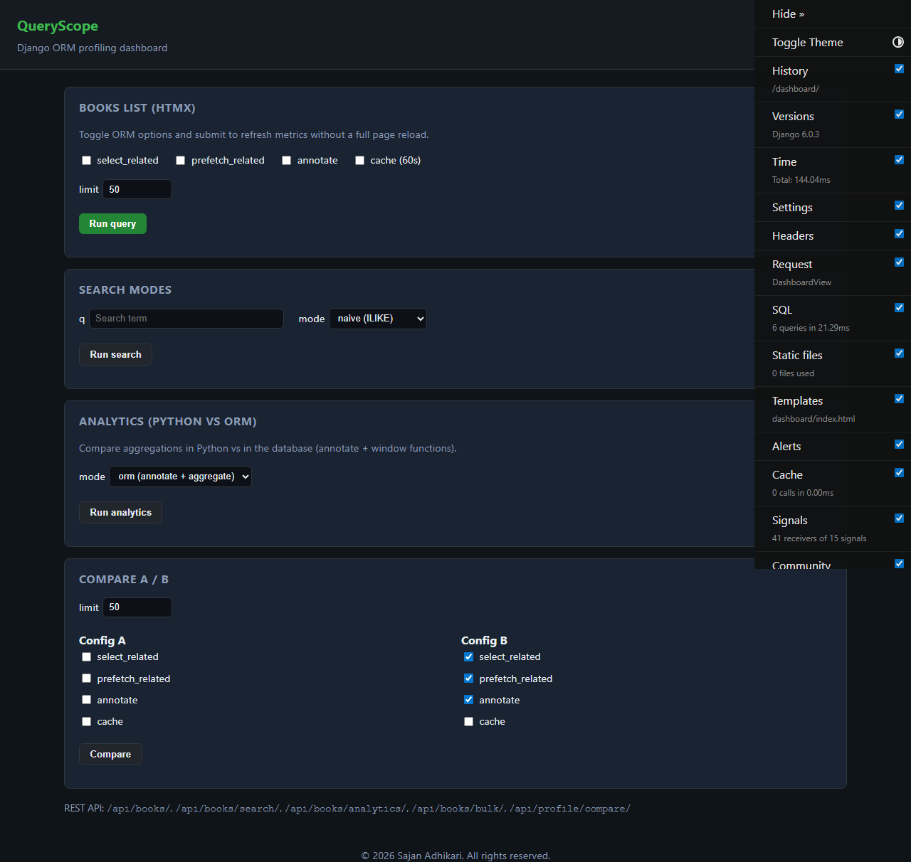
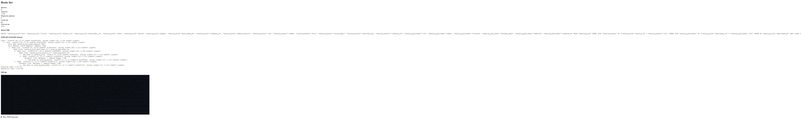

# QueryScope

Django ORM profiling dashboard and bookstore catalog API. Use toggles to compare query counts, timings, SQL logs, and `EXPLAIN ANALYZE` output for the same endpoint with different ORM options.

## Screenshots

Full dashboard (books, search, analytics, compare) and an optimized books partial (HTMX fragment with query metrics):





## Demo videos

**Full tour** — run books query, search, analytics (ORM then Python), compare A/B:

<video src="https://github.com/user-attachments/assets/1ad26c46-47c8-4dc3-8034-ddbe814a3fed" controls width="100%" title="QueryScope dashboard tour"><sourr</video>


## Stack

- Python 3.12+, Django 5.1+ (project pins compatible versions via `pyproject.toml`)
- PostgreSQL 15+ (required for `SearchVectorField`, GIN, window functions)
- Django REST Framework, django-debug-toolbar, django-silk
- Django templates + HTMX on the dashboard

## Setup

1. Install [uv](https://docs.astral.sh/uv/) and run:

   ```bash
   uv sync
   ```

2. Copy `.env.example` to `.env` and adjust `DATABASE_URL` / `SECRET_KEY`.

3. Create the database and migrate:

   ```bash
   createdb queryscope
   uv run python manage.py migrate
   uv run python manage.py seed_db --books 200 --reviews-per-book 10
   ```

4. Run the dev server:

   ```bash
   uv run python manage.py runserver
   ```

- Dashboard: `http://localhost:8000/dashboard/`
- API base: `http://localhost:8000/api/`
- Debug toolbar: `http://localhost:8000/__debug__/`
- Silk: `http://localhost:8000/silk/`

## API overview

| Endpoint | Purpose |
|----------|---------|
| `GET /api/books/` | List with `select_related`, `prefetch_related`, `annotate`, `cache`, `limit` |
| `GET /api/books/<id>/` | Detail with optional same toggles |
| `GET /api/books/search/` | `q`, `mode=naive\|btree\|fulltext` |
| `GET /api/books/analytics/` | `mode=python\|orm` (window rank + aggregates) |
| `POST /api/books/bulk/` | `mode=loop\|bulk`, `count` — create rows |
| `PATCH /api/books/bulk/` | `mode=loop\|bulk` — 10% price update |
| `POST /api/profile/compare/` | JSON `config_a`, `config_b`, `limit` — two profiles + diff |

JSON responses include `_profile` (except compare, which returns two profiles under `config_a` / `config_b`). Response headers include `X-Query-Count`, `X-Query-Time-Ms`, `X-Duplicate-Qs`.

## Tests

```bash
uv run pytest
```

Use `@override_settings(DEBUG=True)` when asserting profiler output; the middleware only enriches JSON when `DEBUG` is true.

## Notes

- `index` on search is reserved for future `pg_hint_plan`-style hints.
- `EXPLAIN ANALYZE` for the slowest query runs inside a savepoint so failures do not abort the surrounding PostgreSQL transaction.
